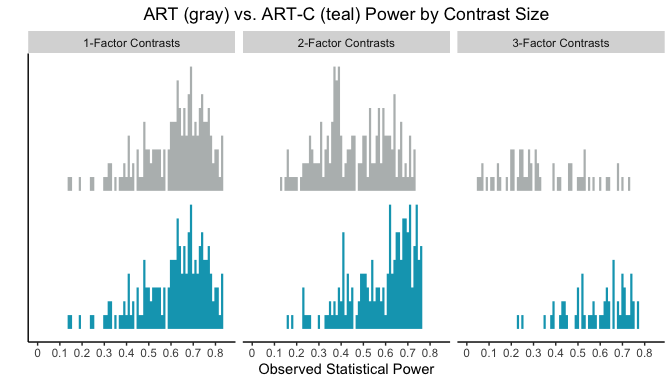
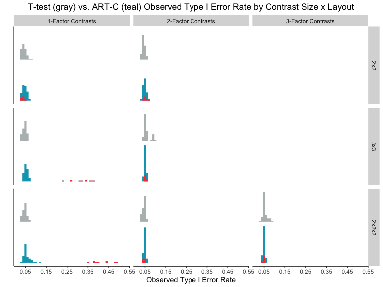

ART-C Analysis and Visualizations
================

# Intro

If you’ve come here after reading our paper because you’re curious about
how we did our analysis and made our visualizations, welcome\! If not,
you can find the paper here for some more technical details (paper link
coming soon).

Either way, we’ll start with a short recap about what we’re doing and
why.

The ART procedure is a nonparametric data analysis method that aligns
and ranks data, and the resulting aligned and ranked data can be
analyzed by an ANOVA. It’s become popular because it’s simple to use and
unlike other popular nonparametric methods, it can find interaction
effects. It can also be used to conduct contrasts that compare levels
within a single factor (i.e., posthoc tests following a significant main
effect), but it can’t be used to conduct contrasts that involve levels
of multiple factors (i.e., posthoc tests following a significant
interaction effect). So, we created a new method, ART-C, that uses a
different procedure to align and rank data and can be used to conduct
multifactor contrasts.

We define a *design* as a unique combination of:  

**Layout**: The number of factors and number of levels per factor in the
data set.  
    Values: two factors with two levels each (2
 2),
two factors with three levels each (3
 3),
and three factors with two levels each (2
 2

2).  
    Column name in logs: Layout

  

**Population Distribution**: We define population as a distribution and
the values of its parameters (e.g. a normal distribution with location =
0 and scale = 1). The term Population Distribution refers only to the
type of distribution and not the values of its parameters (e.g. normal
distribution).  
    Values are: Normal, Lognormal, Exponential, Cauchy, *t*(3), Double
Exponential.  
    Column name in logs: Population\_Distribution

  

**Condition Sample Size**: The number of data points randomly sampled
from a population for each condition.  
    Values: 8, 16, 24, 32, and 40.  
    Column name in logs: Condition\_Sample\_Size

  

**Between or Within Subjects**: Whether the data is from a
between-subjects study or a within-subjects study.  
    Values: B, W.  
    Column name in logs: BW

  

**Contrast Size**: The number of factors whose levels are compared in a
contrast.  
    Values: 1-Factor Contrasts, 2-Factor Contrasts, 3-Factor
Contrasts.  
    Column name in logs: Contrast\_Size.

  

We made 72,000 synthetic data sets (approximately 400 for each possible
design) and evaluated our new procedure on two metrics: Type I error
rate and statistical power. All of the Population Distributions have
**location** parameter (e.g., normal distribution’s mean is its location
parameter and the lognormal distributions logmean is its location
parameter).

To measure Type I error rates, we made approximately 200 data sets for
each possible design in which every condition within a single data set
had the same location. This meant that the true difference between
conditions was always 0, so any time a significant difference we was
(i.e., *p* \< .05), that was a Type I error. For each design, we counted
up the number of times *p* was *\< .05* and divided that by the total
number of tests we did for that design – this is called the *observed
Type I error rate*.

To measure power, we made approximately 200 data sets for each possible
design in which every condition with a single data set had different
locations. This meant that there was always a true difference between
conditions. So, for each design, we counted up the number of times *p*
was *\< .05* and divided that by the total number of tests we did for
that design – this is called the *observed statistical power*.

The code we used to calculate observed Type I error and observed
statistical power for our raw logs can be found here (TODO: link coming
soon), but it’s not the nicest code I’ve ever written, and we really did
just count how many times we saw *p \< .05* and how many tests we did
and divide.

Alright, now that we’ve sifted through some definitions, we can look at
some descriptive statistics and visualizations that compare ART-C to
other methods, including the original ART.

We focus on our large-scale analysis, but if you’d like to see an
example that illustrates the problems with using ART to conduct
multifactor contrasts and how to use the R package we wrote to conduct
multifactor contrasts with ART-C, take a look at the [package
vignette](https://cran.r-project.org/web/packages/ARTool/vignettes/art-contrasts.html).
If you’d like to read a paper on the original ART method, you can find
that
[here](https://dl.acm.org/doi/abs/10.1145/1978942.1978963?casa_token=ZuKwCmxP2iMAAAAA:kF4sSIULiGXilE0NCmmVC6oHnfUI7P8Ffe1F-M2B5gHj9HgOZ_vYM43NUkaCKvzqWDNVZjI0eflAlg).
And, if you’d like to interact with our data more, the data and source
code for this notebook are available (TODO link coming soon)

# Setup

We start by reading in the data and making all factors factors. Each row
has the proportion of significant results over all trials for a single
design.

``` r
dir_name = "./raw_logs"
df = read.csv(paste(dir_name, "/res_ults.csv", sep=""))

df$Layout = factor(df$Layout, levels=c("2x2", "3x3", "2x2x2")) # reorder Layout. needed for plots later
df$Population_Distribution = factor(df$Population_Distribution)
df$Contrast_Size = as.factor(df$Contrast_Size)
df$Condition_Sample_Size = as.factor(df$Condition_Sample_Size)
```

Using some horribly messy code that we’ve omitted, we separate df into
two data frames: df\_same\_loc with results from all designs in which
population locations were the same and will be used to measure Type I
error rates, and df\_diff\_loc with results from all designs in which
population locations were different and will be used to measure
statistical power.

# Comparison with ART

So, we started by saying that we can’t use the original ART to conduct
multifactor contrasts, but we’ve got to back that up with some data. We
used the original ART to conduct contrasts on our 72,000 synthetic data
sets and illustrate the results here. We also compare it to ART-C.

## ART Type I Error

Let’s look at some descriptive stats: the overall mean and standard
deviation of Type I error for both ART-C and ART. Remember, we
calculated Type I error for each design, so this is the mean and
standard deviation of those per-design Type I error rates.

    ## ART Type I error mean 0.1187472

    ## ART Type I error SD 0.1724412

    ## ART-C Type I error mean: 0.06525816

    ## ART-C Type I error SD 0.07125876

The mean Type I error rate for ART is .12, which is much larger than its
expected value of .05. In comparison, ART-C’s mean Type I error rate is
much closer to .05, although it still seems a bit high, but that’s due
to one egregious case, which we’ll discuss below.

### ART Type I error by Population Distribution

Now a more granular approach: let’s compare ART and ART-C Type I error
when we split up designs by Population Distribution. First, some
descriptive statistics:

ART

``` r
ddply(df_same_loc, .(Population_Distribution), summarize, mean = mean(ART_Omni_Proportion_Sig), sd = sd(ART_Omni_Proportion_Sig))
```

    ##   Population_Distribution       mean         sd
    ## 1               Lognormal 0.14083198 0.09616724
    ## 2                  Normal 0.02388222 0.02315966
    ## 3             Exponential 0.06475505 0.04819342
    ## 4                  Cauchy 0.42474624 0.20933617
    ## 5                    t(3) 0.03270243 0.01546156
    ## 6      Double Exponential 0.02556511 0.02255269

ART-C

``` r
ddply(df_same_loc, .(Population_Distribution), summarize, mean = mean(ART_Con_Proportion_Sig), sd = sd(ART_Con_Proportion_Sig))
```

    ##   Population_Distribution       mean          sd
    ## 1               Lognormal 0.05404593 0.015335095
    ## 2                  Normal 0.04884978 0.008172849
    ## 3             Exponential 0.05070027 0.007374186
    ## 4                  Cauchy 0.13988917 0.153585610
    ## 5                    t(3) 0.04893364 0.006285141
    ## 6      Double Exponential 0.04913016 0.007072491

Now the vizualtion. with ART in gray and ART-C in teal.

``` r
# create df with only single-factor contrasts
df_same_loc_1factor = df_same_loc %>% filter(Contrast_Size == "1-Factor Contrasts")

# tick spacing
breaks.x = seq(0.05,.75,0.1)

# labels are character versions of breaks
labels.x = as.character(breaks.x)

p = ggplot(df_same_loc) +
   geom_density( aes(x = ART_Omni_Proportion_Sig, y= ..count..), stat="binline", binwidth=.01, draw_baseline=FALSE, fill="azure4",color=NA, alpha=.6, position = position_nudge(y=50)) +
   geom_density( aes(x = ART_Con_Proportion_Sig, y= ..count..), stat="binline", binwidth=.01, draw_baseline=FALSE, fill=teal,color=NA) +
  theme +
  xlab("Observed Type I error rate") +
  ylab("") +
  scale_x_continuous(breaks = breaks.x, label = labels.x, limits = range(df_same_loc$ART_Omni_Proportion_Sig), expand=c(0,0))+
  facet_wrap(~Population_Distribution, ncol=3) +
  labs(title = "ART (gray) vs. ART-C (teal) Type I Error Rate by Population Distribution")

p
```

<!-- -->

We can see that the original ART inflates Type I error rates for data
drawn from lognormal, exponential, and Cauchy populations, and for all
distributions ART Type I error rates are also further from the expected
value of .05 than ART-C’s. This means the orignal ART is *less correct*
than ART-C because the definition of correct is “Observed Type I error
rates are close to their expected value”.

We looked at how other design properties affect the differences because
ART and ART-C Type I error rates and didn’t find anything interesting,
but you can use the source code for this notebook to look at it
yourself.

## ART Power

So, we know that ART has infalted Type I error rates, but it’s still
worth looking at how its power compares to ART-C.

    ## ART power mean 0.5098959

    ## ART power SD 0.1838599

    ## ART-C power mean 0.5981218

    ## ART-C power SD 0.1432977

Overall, ART-C has greater power than the original ARt. While a .09
difference might not seem like a lot, that means that ART-C found true
differences 10% more often than the original ART, which is actually
quite a big difference.

### ART Power by Population Distribution

Just like we did with Type I error, we group designs by Population
Distribution and compare ART power to ART-C power.

ART

``` r
ddply(df_diff_loc, .(Population_Distribution), summarize, mean = mean(ART_Omni_Proportion_Sig), sd = sd(ART_Omni_Proportion_Sig))
```

    ##   Population_Distribution      mean        sd
    ## 1               Lognormal 0.6159530 0.1435732
    ## 2                  Normal 0.4875290 0.1846556
    ## 3             Exponential 0.5838031 0.1585379
    ## 4                  Cauchy 0.5131002 0.1599107
    ## 5                    t(3) 0.4215320 0.1831623
    ## 6      Double Exponential 0.4374581 0.1886694

ART-C

``` r
ddply(df_diff_loc, .(Population_Distribution), summarize, mean = mean(ART_Con_Proportion_Sig), sd = sd(ART_Con_Proportion_Sig))
```

    ##   Population_Distribution      mean        sd
    ## 1               Lognormal 0.6865944 0.1018846
    ## 2                  Normal 0.6570850 0.0909288
    ## 3             Exponential 0.6606709 0.1083136
    ## 4                  Cauchy 0.4056335 0.1346811
    ## 5                    t(3) 0.5779982 0.1090603
    ## 6      Double Exponential 0.6007488 0.1040977

Now vizualizing with ART in gray and ART-C in teal.

``` r
# create df with only single-factor contrasts
df_diff_loc_1factor = df_diff_loc %>% filter(Contrast_Size == "1-Factor Contrasts")

# tick spacing
breaks.x = seq(0,.9,0.1)
# labels are character versions of breaks
labels.x = as.character(breaks.x)

# plot histogram of power for artcon, param, and nonparam overlapping.
p = ggplot(df_diff_loc) +
 geom_density( aes(x = ART_Omni_Proportion_Sig, y= ..count..), stat="binline", binwidth=.01, draw_baseline=FALSE, fill="azure4", color=NA, alpha=.6, position = position_nudge(y=11)) +
   geom_density( aes(x = ART_Con_Proportion_Sig, y= ..count..), stat="binline", binwidth=.01, draw_baseline=FALSE, fill=teal,color=NA) +
  theme+
  xlab("Observed Statistical Power") +
  ylab("") +
  scale_x_continuous(breaks = breaks.x, label = labels.x, limits = range(df_diff_loc$ART_Omni_Proportion_Sig)) +
  # scale_y_continuous(breaks = breaks.y, label = labels.y) +
  facet_wrap(~Population_Distribution, ncol=2)+
  labs(title = "ART (gray) vs. ART-C (teal) Power by Population Distribution")

p
```

<!-- -->

The descriptive stats and this figure both show us that ART-C has
greater power than ART for every Population Distribution.

### ART Power by Contrast Size

Contrast size also has an interesting effect on ART power (and the
difference between ART and ART-C power).

ART

``` r
ddply(df_diff_loc, .(Contrast_Size), summarize, mean = mean(ART_Omni_Proportion_Sig), sd = sd(ART_Omni_Proportion_Sig))
```

    ##        Contrast_Size      mean        sd
    ## 1 1-Factor Contrasts 0.6162018 0.1471774
    ## 2 2-Factor Contrasts 0.4606213 0.1514769
    ## 3 3-Factor Contrasts 0.3388019 0.1818883

ART-C

``` r
ddply(df_diff_loc, .(Contrast_Size), summarize, mean = mean(ART_Con_Proportion_Sig), sd = sd(ART_Con_Proportion_Sig))
```

    ##        Contrast_Size      mean        sd
    ## 1 1-Factor Contrasts 0.6162018 0.1471774
    ## 2 2-Factor Contrasts 0.5829068 0.1416638
    ## 3 3-Factor Contrasts 0.5895269 0.1320799

Now visualizing (again, ART in gray and ART-C in teal):

``` r
# plot histogram of power for artcon, param, and nonparam overlapping.
p = ggplot(df_diff_loc) +
  geom_density( aes(x = ART_Omni_Proportion_Sig, y= ..count..), stat="binline", binwidth=.01, draw_baseline=FALSE, fill="azure4", color= NA, alpha=.6, size=.15, position = position_nudge(y=10)) +
  geom_density( aes(x = ART_Con_Proportion_Sig, y= ..count..), stat="binline", binwidth=.01, draw_baseline=FALSE, fill=teal,color=NA, size=.15) +
  theme +
  xlab("Observed Statistical Power") +
  ylab("") +
  scale_x_continuous(breaks = breaks.x, label = labels.x, limits = c(0, max(df_diff_loc$ART_Con_Proportion_Sig))) +
  facet_wrap(~Contrast_Size, nrow=1) +
  labs(title = "ART (gray) vs. ART-C (teal) Power by Contrast Size")

p
```

<!-- -->

ART and ART-C are mathematically equivalent when analyzing 1-factor
contrasts, but when we look at 2-factor contrasts and 3-factor
contrasts, things get interesting. ART-C’s power is pretty similar for
each Contrast Size, but ART’s power decreases as Contrast Size
increases. It’s not clear why this happens, but certainly is a reason to
avoid using the original ART to conduct multifactor contrasts.

Now we know that ART inflates Type I error rate and has lower power than
ART-C for all population distributions and becomes less likely to find
true differences as the number of factors whose levels are involved in a
contrast increases. We know that ART-C has lower Type I error and
greater power than the ART, which means it’s the better method to use to
conduct contrasts *within the ART paradigm*. However, we also need to
see how its Type I error and power compare to other methods’.

# Type I Error Rate

A common practice in statistics is the use the *t*-test as a baseline
comparison for Type I error rate, so that’s what we do here.

When looking at our data we saw that 1-Factor Contrasts from a 2
 2
 2 or
3  3
Layout and a Cauchy Population Distribution have very high Type I error
rates. We make a new data frame with just those data sets, aptly named
*df\_same\_loc\_bad\_cauchy* and look at some descriptive stats, and we
use the term *bad Cauchy* to describe those designs.

``` r
# descriptive stats with single factor cauchy contrasts from 2x2x2 and 3x3 distrs
df_same_loc_bad_cauchy = df_same_loc %>% filter(Population_Distribution == "Cauchy" & Contrast_Size == '1-Factor Contrasts' & Layout != "2x2")
```

ART-C

    ## ART-C bad Cauchy mean 0.3726467

    ## ART-C bad Cauchy SD 0.07546431

t-test

    ## t-test bad Cauchy mean 0.02448918

    ## t-test bad Cauchy sd 0.003883159

ART-C Type I error rates on “bad Cauchy” data are really high and the
*t*-test Type I error rates aren’t. For the remainder of this Type I
error rate analysis, we omit all “bad Cauchy” data. We write “no Cauchy”
below, but that’s a bit misleading. It really means no Cauchy
 (2
 2
 2 or
3  3)

1-Factor Contrasts

``` r
# remove single factor cauchy contrasts from 2x2x2 and 3x3 distrs since we know they're bad
df_same_loc_no_cauchy = df_same_loc %>% filter(Population_Distribution != "Cauchy" | Contrast_Size != '1-Factor Contrasts' | Layout == "2x2")
```

We look at descriptive stats for the remaining designs.

ART-C

    ## ART-C Type I error rate mean 0.04988873

    ## ART-C Type I error rate SD 0.009387004

    ## t-test Type I error rate mean 0.0477396

    ## t-test Type I error rate SD 0.012325

ART-C and the *t*-test both have mean Type I error rates really close to
their expected value of .05, but the standard deviation for ART-C is
much smaller, and we’ll see in the visualization that ART-C Type I error
rates are more closely clustered are .05 than the *t*-test’s are.

### Type I Error by Contrast Size  Layout

None of the design properties (aside from the Cauchy scenario discussed
above) have a large impact on observed Type I error rate. We chose to
visualize and describe it using Contrast Size

Layout. Some descriptive stats:

ART-C

``` r
ddply(df_same_loc_no_cauchy, .(Contrast_Size,Layout), summarize, mean = mean(ART_Con_Proportion_Sig), sd = sd(ART_Con_Proportion_Sig))
```

    ##        Contrast_Size Layout       mean          sd
    ## 1 1-Factor Contrasts    2x2 0.04611049 0.011043811
    ## 2 1-Factor Contrasts    3x3 0.05260397 0.008684828
    ## 3 1-Factor Contrasts  2x2x2 0.05693477 0.016183661
    ## 4 2-Factor Contrasts    2x2 0.04766285 0.007782842
    ## 5 2-Factor Contrasts    3x3 0.05014737 0.004387717
    ## 6 2-Factor Contrasts  2x2x2 0.04839978 0.004793275
    ## 7 3-Factor Contrasts  2x2x2 0.04898875 0.004466714

T-test

``` r
# descriptive statistics broken down by num factors in contrast and Layout - t-test
ddply(df_same_loc_no_cauchy, .(Contrast_Size,Layout), summarize, mean = mean(Param_Proportion_Sig), sd = sd(Param_Proportion_Sig))
```

    ##        Contrast_Size Layout       mean          sd
    ## 1 1-Factor Contrasts    2x2 0.03950532 0.013769937
    ## 2 1-Factor Contrasts    3x3 0.04806399 0.006819141
    ## 3 1-Factor Contrasts  2x2x2 0.04769974 0.008688110
    ## 4 2-Factor Contrasts    2x2 0.04227875 0.008597558
    ## 5 2-Factor Contrasts    3x3 0.05771661 0.015502498
    ## 6 2-Factor Contrasts  2x2x2 0.04504088 0.007441326
    ## 7 3-Factor Contrasts  2x2x2 0.05391930 0.010950598

Now Visualizing.

``` r
# df_same_loc_bad_cauchy is only the cauchy distrs with 1-factor contrasts and 3x3 or 2x2x2 designs. This is all of them
df_same_loc_just_cauchy = df_same_loc %>% filter(Population_Distribution == "Cauchy")

# tick spacing
breaks.x = seq(0.05,1,0.1)

# labels are character versions of breaks
labels.x = as.character(breaks.x)

p =ggplot(df_same_loc) +
 geom_density( aes(x = Param_Proportion_Sig, y= ..count..), stat="binline", binwidth=.01, draw_baseline=FALSE, fill="azure4", color = NA, alpha=.6,
               position = position_nudge(y=50)) +
 geom_density( aes(x = ART_Con_Proportion_Sig, y= ..count..), stat="binline", binwidth=.01, draw_baseline=FALSE, fill=teal, color=NA) +
 geom_density( data = df_same_loc_just_cauchy, aes(x = ART_Con_Proportion_Sig, y= ..count..), stat="binline", binwidth=.01, draw_baseline=FALSE, fill="brown1",color=NA) +
theme+
  # set x-axis label
  xlab("Observed Type I Error Rate") +
  # set y-axis label to nothing
  ylab("") +
  scale_x_continuous(breaks = breaks.x, label = labels.x, limits = (range(df_same_loc$ART_Con_Proportion_Sig))) +
  facet_grid(Layout~Contrast_Size, scale="free_x")+
  labs(title = "T-test (gray) vs. ART-C (teal) Observed Type I Error Rate by Contrast Size x Layout")

# show plot p
p
```

<!-- -->

Overall, ART-C Type I error rates look really good\! They’re closer to
their expected value of .05 than *t*-test Type I error rates for all
combinations of Contrast Size

Layout except for the “bad Cauchy” designs. The *t*-test’s Type I error
rates are still pretty good – the real advantage of using ART-C is its
power.

# Power

The last step in validating ART-C is to see if it has high statistical
power. To recap, statistical power is the probability that a method will
find a true difference. We compared ART-C statistical power to: a
*t*-test, Mann-Whitney *U* test for between-subjects designs and
Wilcoxon signed-rank test signed rank test for within-subjects designs.

First, let’s look at some overall descriptive stats for all methods.

    ## ART-C power mean 0.5981218

    ## ART-C power SD 0.1432977

    ## t-test power mean 0.4624148

    ## t-test power SD 0.2078816

    ## Mann-Whitney U test / Wilcoxon signed rank test power mean 0.5225028

    ## Mann-Whitney U test / Wilcoxon signed rank test power SD 0.1477614

Overall, ART-C has greater power than the other methods. When we looked
through our data, we saw that most of the design properties didn’t
impact the differences between methods’ power. Condition Sample Size and
Population Distribution were both interesting so we focus on those here.
Again, you can look into this more on your own by tweaking the source
code for this notebook.

### Power by Condition Sample Size

Some descriptive stats:

ART-C

``` r
# descriptive statistics broken down by distribution type - ART-C
ddply(df_diff_loc, .(Condition_Sample_Size), summarize, mean = mean(ART_Con_Proportion_Sig), sd = sd(ART_Con_Proportion_Sig))
```

    ##   Condition_Sample_Size      mean        sd
    ## 1                     8 0.4323934 0.1080926
    ## 2                    16 0.5594330 0.1137514
    ## 3                    24 0.6334287 0.1104768
    ## 4                    32 0.6675345 0.1020046
    ## 5                    40 0.6978194 0.1044916

*T*-test

``` r
# descriptive statistics broken down by distribution type - t-test
ddply(df_diff_loc, .(Condition_Sample_Size), summarize, mean = mean(Param_Proportion_Sig), sd = sd(Param_Proportion_Sig))
```

    ##   Condition_Sample_Size      mean        sd
    ## 1                     8 0.3267324 0.1328760
    ## 2                    16 0.4265947 0.1785088
    ## 3                    24 0.4889741 0.2022055
    ## 4                    32 0.5200077 0.2146672
    ## 5                    40 0.5497652 0.2234798

Mann-Whitney *U* Test / Wilcoxon Signed Rank Test

``` r
# descriptive statistics broken down by distribution type - nonparam
ddply(df_diff_loc, .(Condition_Sample_Size), summarize, mean = mean(Nonparam_Proportion_Sig), sd = sd(Nonparam_Proportion_Sig))
```

    ##   Condition_Sample_Size      mean         sd
    ## 1                     8 0.3283923 0.08560591
    ## 2                    16 0.4733339 0.10357536
    ## 3                    24 0.5602824 0.10323825
    ## 4                    32 0.6074496 0.09384427
    ## 5                    40 0.6430559 0.09307663

All methods’ power increased with Condition Sample Size, but their
relative differences remained the same, and ART-C always had the greater
power than the other methods.

### Power by Population Distribution

The other design property that had an impact on power was Population
Distribution.

ART-C

``` r
# descriptive statistics broken down by distribution type - ART-C
ddply(df_diff_loc, .(Population_Distribution), summarize, mean = mean(ART_Con_Proportion_Sig), sd = sd(ART_Con_Proportion_Sig))
```

    ##   Population_Distribution      mean        sd
    ## 1               Lognormal 0.6865944 0.1018846
    ## 2                  Normal 0.6570850 0.0909288
    ## 3             Exponential 0.6606709 0.1083136
    ## 4                  Cauchy 0.4056335 0.1346811
    ## 5                    t(3) 0.5779982 0.1090603
    ## 6      Double Exponential 0.6007488 0.1040977

*T*-test

``` r
# descriptive statistics broken down by distribution type - t-test
ddply(df_diff_loc, .(Population_Distribution), summarize, mean = mean(Param_Proportion_Sig), sd = sd(Param_Proportion_Sig))
```

    ##   Population_Distribution       mean         sd
    ## 1               Lognormal 0.46286871 0.10991417
    ## 2                  Normal 0.65928062 0.09091467
    ## 3             Exponential 0.51884954 0.11902740
    ## 4                  Cauchy 0.07391699 0.02142993
    ## 5                    t(3) 0.50188099 0.10281525
    ## 6      Double Exponential 0.55769188 0.10207533

Mann-Whitney *U* Test / Wilcoxon Signed Rank Test Power

``` r
# descriptive statistics broken down by distribution type - nonparam
ddply(df_diff_loc, .(Population_Distribution), summarize, mean = mean(Nonparam_Proportion_Sig), sd = sd(Nonparam_Proportion_Sig))
```

    ##   Population_Distribution      mean        sd
    ## 1               Lognormal 0.5826765 0.1190024
    ## 2                  Normal 0.5942452 0.1174355
    ## 3             Exponential 0.5586135 0.1245237
    ## 4                  Cauchy 0.3438525 0.1237962
    ## 5                    t(3) 0.5166073 0.1263100
    ## 6      Double Exponential 0.5390220 0.1222124

Visualizing:

``` r
# remove cauchy for spacing
df_diff_loc_no_cauchy = df_diff_loc %>% filter(Population_Distribution != "Cauchy")

# tick spacing
breaks.x = seq(0,.9,0.1)

# labels are character versions of breaks
labels.x = as.character(breaks.x)

# plot histogram of power for artcon, param, and nonparam overlapping.
p = ggplot(df_diff_loc) +
  geom_density( aes(x = Nonparam_Proportion_Sig, y= ..count..), stat="binline", binwidth=.01, draw_baseline=FALSE, fill="white",position = position_nudge(y=11))+
 geom_density( aes(x = Param_Proportion_Sig, y= ..count..), stat="binline", binwidth=.01, draw_baseline=FALSE, fill="azure4", color=NA, alpha=.6, position = position_nudge(y = 20)) +
   geom_density( aes(x = ART_Con_Proportion_Sig, y= ..count..), stat="binline", binwidth=.01, draw_baseline=FALSE, fill=teal,color=NA) +
  theme+
  xlab("Observed Statistical Power") +
  ylab("") +
  scale_x_continuous(breaks = breaks.x, label = labels.x, limits = c(breaks.x[[1]],    breaks.x[length(breaks.x)])) +
  facet_wrap(~Population_Distribution, ncol=2)+
  labs(title = "ART-C (teal) vs.
  Mann-Whitney U Test / Wilcoxon Signed Rank Test (black outline) vs.
  T-test (gray) Observed Staistical Power by Population Distribution")

p
```

<!-- -->

ART-C had greater power than a *t*-test for all non-normal distributions
(to be expected since the *t*-test is meant for normal distributions)
and greater power than Mann-Whitney *U* test / Wilcoxon signed rank test
for all distributions.

To summarize: When used to conduct multifactor contrasts, ART-C does not
inflate Type I error rate (as oppose to the original ART) and has
greater power than *t*-test, Mann-Whitney *U* test, Wilcoxon signed rank
test, and the original ART.
